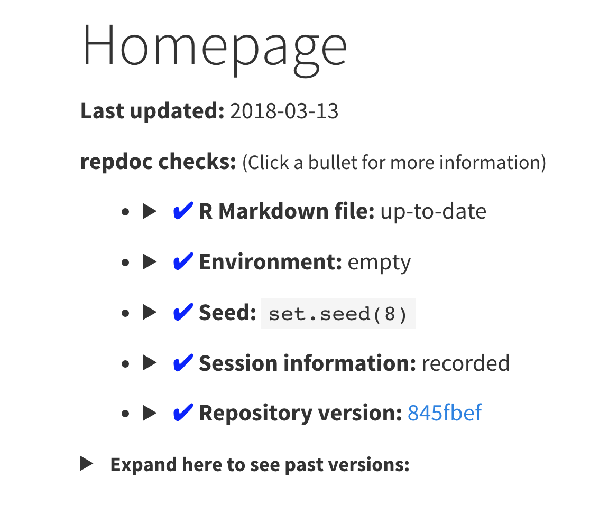

# repdoc

repdoc provides a custom output format for use with standalone R Markdown files
or R Markdown websites. In combination with a Git repository for version
control, it implements multiple features to facilitate reproducibility:

* Inserts the date the HTML file was last updated
* Inserts the version of the Git repository when the HTML file was built
* Warns if the R Markdown file had unsaved changes when the HTML file was built
* Reports past versions of the HTML file
* Reports past versions of the R Markdown file
* Sets a seed for random number generation
* Inserts the session information at the end of the HTML file
* Organizes the output figure files by the R Markdown file that generated them
* Reports the status of the Git repository
* Reports if there were variables defined in the global environment
* Reports past versions of figure files

This package is for testing features before integrating them into
[workflowr](https://github.com/jdblischak/workflowr).

Example screenshot of reproducibility report added to beginning of R Markdown file:



## Installation

You can install repdoc from GitHub with:

``` r
# install.packages("devtools")
devtools::install_github("jdblischak/repdoc")
```

## Give it a try

To try out repdoc, specify `repdoc_html` as the output format in the YAML header
of one of your existing R Markdown files and then render with
`rmarkdown::render` or the RStudio Knit button. For best results, the R Markdown
file should be versioned in a Git repository:

```
output: repdoc::repdoc_html
```

You can customize the settings directly in the YAML header. The options below
specify setting the seed with `set.seed(3)` and reporting the session
information using `devtools::session_info()` instead of the default
`sessionInfo()`.

```
repdoc:
  seed: 3
  sessioninfo: "devtools::session_info()"
output: repdoc::repdoc_html
```

## Example 1: A single R Markdown file

The analysis in `ex1-single-file` demonstrates how repdoc can add
reproducibility features to a single R Markdown analysis. Use
`rmarkdown::render` or the RStudio Knit button to render the file.

## Example 2: An R Markdown website

The analysis in `ex2-website` demonstrates how repdoc can add reproducibility
features to an entire R Markdown website by specifying `repdoc::repdoc_html` as
the output format in the shared `_site.yml` file. This also requires specifying
the custom site generator `repdoc::repdoc_site` in the YAML header of the
`index.Rmd` file. Since it is a website, use `rmarkdown::render_site` or the
RStudio Knit button to render the file.

```
site: repdoc::repdoc_site
```

## Example 3: An R Markdown website with a different knit directory

The analysis in `ex3-website-subir` demonstrates how repdoc can additionally be
used to set `knit_root_dir` across the R Markdown files. This facilitates
organizing the R Markdown files into a subdirectory but still executing them
from the root of the project. Furthermore, it uses `_repdoc.yml` to share repdoc
options across the R Markdown files. Since it is a website, use
`rmarkdown::render_site` or the RStudio Knit button to render the file.

## Design

The main challenge of repdoc is inserting code chunks at the beginning and end
of R Markdown files with no disruption of the end user when writing the R
Markdown document.

### Custom output format

The custom output format `repdoc_html` extends `rmarkdown::html_document`. Thus
any arguments for `rmarkdown::html_document`, e.g. `toc = TRUE` to add a table
of contents, can be passed directly to `repdoc::repdoc_html`.

It sets knitr options, including modifying the path to save figures, by setting
the `knitr` argument of `output_format`.

It adds a custom footer to the output HTML using the `pre_processor` argument
of `output_format` to pass `--include-after-body` to Pandoc.

The above options follow the R Markdown documentation. In order to add code to
chunks to the beginning of the file (to set the seed) and the end of the file
(to record the session information), repdoc_html needs to edit the source R
Markdown file before it is rendered. To accomplish this, it creates and modifies
a temporary version of the R Markdown file, and then has `rmarkdown::render`
build this temporary file by accessing the enclosing environment and changing
the name of the input file. This is performed using the `post_knit` argument of
`output_format`. This is quite hacky, and I would love to know if there were a
better way to accomplish this.

To set `knit_root_dir` from the YAML header or `_repdoc.yml`, `repdoc_html` uses
the same environment trick that it uses to modify the input file. It changes the
argument `knit_root_dir` used by `render`.

### Custom site generator

`repdoc_site` is a custom site generator for use with `repdoc_html` to create R
Markdown websites using `rmarkdown::render_site`.

It knows that the figures file are written to `figure/<basename of Rmd file>`,
so it moves these if there is an `output_dir` set in `_site.yml`.

It automatically sets `self_contained: false` and `lib_dir: site_libs` by
passing these to `render` via the `output_options` argument. This will throw an
error if the user specifies, e.g. `pdf_document`, in `_site.yml`, but they
should be discouraged from doing so. If they want a non-HTML format, they can
build it by passing the output format directly to `render`, e.g.
`render("file.Rmd", pdf_document())`.

### Configuration file

To share repdoc settings across multiple R Markdown files, create a file called
`_repdoc.yml`. This file can be in the same directory as the R Markdown file or
an upstream directory. If a relative filepath is used to set `knit_root_dir`,
then this filepath is interpreted as relative to the location of the
`_repdoc.yml` file. For example, in `ex3-website-subdir/`, `_repdoc.yml` sets
`knit_root_dir` to `"."`. Thus the files are knit in `ex3-website-subdir/` and
not `ex3-website-subdir/analysis/`.

```
ex3-website-subdir/
├── analysis
│   ├── about.Rmd
│   ├── index.Rmd
│   └── _site.yml
├── README.md
└── _repdoc.yml
```
